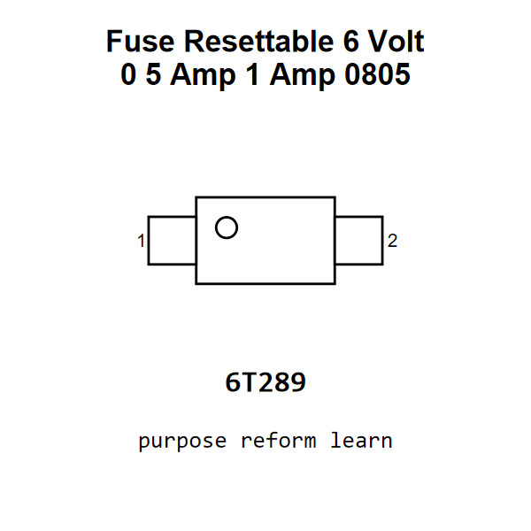

<!-- Generated item page. Full data lives in the source repository. -->
[Catalogue](../../../../README.md) / [Electronic](../../../README.md) / [Fuse](../../README.md) / [0805](../README.md) / Resettable 6 Volt 0 5 Amp 1 Amp

# ⚡ Fuse Resettable 6 Volt 0 5 Amp 1 Amp 0805

> Fuse Resettable 6 Volt 0 5 Amp 1 Amp 0805 is an OOMP electronic fuse definition. It uses the 0805 package or form factor. Its nominal drawing size is 2.0 × 1.25 mm. The definition includes 2 documented pins.

[Full details →](https://github.com/oomlout/oomp_electronic_version_5/tree/main/parts/electronic_fuse_0805_resettable_6_volt_0_5_amp_1_amp)

## At a glance

| Detail | Value |
| --- | --- |
| Type | Fuse |
| Package / style | 0805 |
| Nominal size | 2.0 × 1.25 mm |
| Documented pins | 2 |
| OOMP ID | `electronic_fuse_0805_resettable_6_volt_0_5_amp_1_amp` |

## Catalogue location

`Electronic › Fuse › 0805 › Resettable 6 Volt 0 5 Amp 1 Amp`

## About this page

This is the compact catalogue view. A detailed source README is available. Schematics, fabrication data, working metadata, alternate diagrams, availability data, and project analysis stay with the [full original record](https://github.com/oomlout/oomp_electronic_version_5/tree/main/parts/electronic_fuse_0805_resettable_6_volt_0_5_amp_1_amp).

---

[↑ Parent category](../README.md) · [Catalogue home](../../../../README.md)
