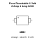

<!-- Generated item page. Full data lives in the source repository. -->
[Catalogue](../../../../README.md) / [Electronic](../../../README.md) / [Fuse](../../README.md) / [1210](../README.md) / Resettable 6 Volt 2 Amp 4 Amp

# ⚡ Fuse Resettable 6 Volt 2 Amp 4 Amp 1210

> Fuse Resettable 6 Volt 2 Amp 4 Amp 1210 is an OOMP electronic fuse definition. It uses the 1210 package or form factor. Its nominal drawing size is 3.2 × 2.5 mm. The definition includes 2 documented pins.

**[Full details →](https://github.com/oomlout/oomp_electronic_version_5/tree/main/parts/electronic_fuse_1210_resettable_6_volt_2_amp_4_amp)**

## At a glance

| Detail | Value |
| --- | --- |
| Type | Fuse |
| Package / style | 1210 |
| Nominal size | 3.2 × 2.5 mm |
| Documented pins | 2 |
| OOMP ID | `electronic_fuse_1210_resettable_6_volt_2_amp_4_amp` |

## Catalogue location

`Electronic › Fuse › 1210 › Resettable 6 Volt 2 Amp 4 Amp`

## About this page

This is the compact catalogue view. A detailed source README is available. Schematics, fabrication data, working metadata, alternate diagrams, availability data, and project analysis stay with the [full original record](https://github.com/oomlout/oomp_electronic_version_5/tree/main/parts/electronic_fuse_1210_resettable_6_volt_2_amp_4_amp).

---

[↑ Parent category](../README.md) · [Catalogue home](../../../../README.md)
