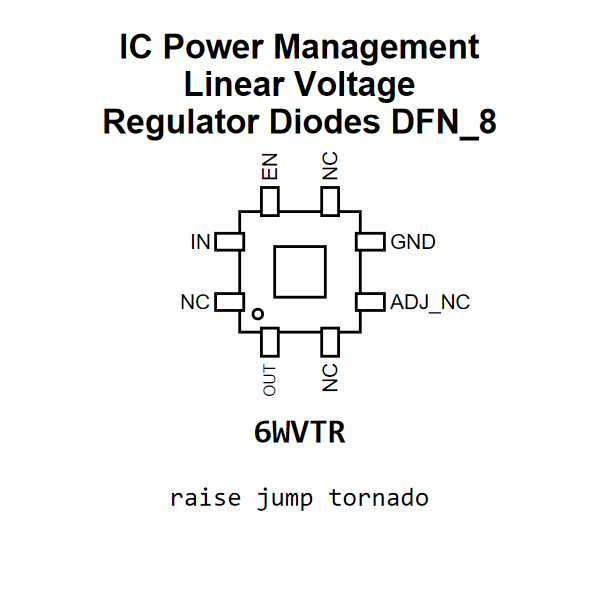

<!-- Generated item page. Full data lives in the source repository. -->
[Catalogue](../../../../../../../README.md) / [Electronic](../../../../../../README.md) / [IC](../../../../../README.md) / [Dfn 8](../../../../README.md) / [Power Management](../../../README.md) / [Linear Voltage Regulator](../../README.md) / [Diodes](../README.md) / Ap7361c 3 3v

# ⚡ IC Power Management Linear Voltage Regulator Diodes DFN_8

> IC Power Management Linear Voltage Regulator Diodes DFN_8 is an OOMP electronic ic definition. It uses the dfn 8 package or form factor. Its nominal drawing size is 3.0 × 3.0 mm. The definition includes 8 documented pins.

[Full details →](https://github.com/oomlout/oomp_electronic_version_5/tree/main/parts/electronic_ic_dfn_8_power_management_linear_voltage_regulator_diodes_ap7361c_3_3v)

## At a glance

| Detail | Value |
| --- | --- |
| Type | Ic |
| Package / style | dfn 8 |
| Nominal size | 3.0 × 3.0 mm |
| Documented pins | 8 |
| OOMP ID | `electronic_ic_dfn_8_power_management_linear_voltage_regulator_diodes_ap7361c_3_3v` |

## Catalogue location

`Electronic › IC › Dfn 8 › Power Management › Linear Voltage Regulator › Diodes › Ap7361c 3 3v`

## About this page

This is the compact catalogue view. A detailed source README is available. Schematics, fabrication data, working metadata, alternate diagrams, availability data, and project analysis stay with the [full original record](https://github.com/oomlout/oomp_electronic_version_5/tree/main/parts/electronic_ic_dfn_8_power_management_linear_voltage_regulator_diodes_ap7361c_3_3v).

---

[↑ Parent category](../README.md) · [Catalogue home](../../../../../../../README.md)
