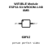

<!-- Generated item page. Full data lives in the source repository. -->
[Catalogue](../../../../../../../README.md) / [Electronic](../../../../../../README.md) / [IC](../../../../../README.md) / [Esp32 S3 Wroom 1](../../../../README.md) / [Microcontroller](../../../README.md) / [Wifi Bluetooth 8 Mb Flash](../../README.md) / [Espressif](../README.md) / Esp32 S3 Wroom 1 N8

# ⚡ WiFi/BLE Module ESP32-S3-WROOM-1-N8 8MB

> WiFi/BLE Module ESP32-S3-WROOM-1-N8 8MB is an OOMP electronic ic definition. It uses the esp32 s3 wroom 1 package or form factor. Its nominal drawing size is 18.0 × 25.5 mm.

**[Full details →](https://github.com/oomlout/oomp_electronic_version_5/tree/main/parts/electronic_ic_esp32_s3_wroom_1_microcontroller_wifi_bluetooth_8_mb_flash_espressif_esp32_s3_wroom_1_n8)**

## At a glance

| Detail | Value |
| --- | --- |
| Type | Ic |
| Package / style | esp32 s3 wroom 1 |
| Nominal size | 18.0 × 25.5 mm |
| OOMP ID | `electronic_ic_esp32_s3_wroom_1_microcontroller_wifi_bluetooth_8_mb_flash_espressif_esp32_s3_wroom_1_n8` |

## Catalogue location

`Electronic › IC › Esp32 S3 Wroom 1 › Microcontroller › Wifi Bluetooth 8 Mb Flash › Espressif › Esp32 S3 Wroom 1 N8`

## About this page

This is the compact catalogue view. A detailed source README is available. Schematics, fabrication data, working metadata, alternate diagrams, availability data, and project analysis stay with the [full original record](https://github.com/oomlout/oomp_electronic_version_5/tree/main/parts/electronic_ic_esp32_s3_wroom_1_microcontroller_wifi_bluetooth_8_mb_flash_espressif_esp32_s3_wroom_1_n8).

---

[↑ Parent category](../README.md) · [Catalogue home](../../../../../../../README.md)
