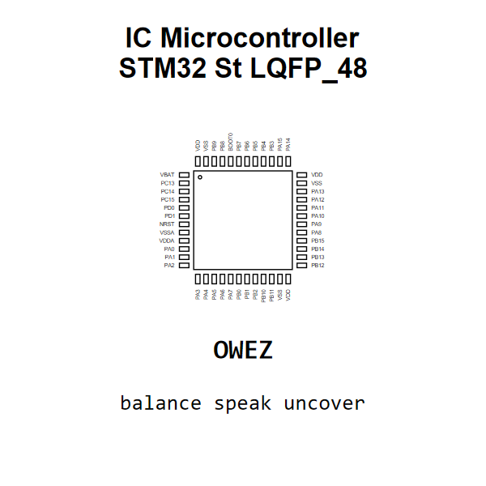

<!-- Generated item page. Full data lives in the source repository. -->
[Catalogue](../../../../../../../README.md) / [Electronic](../../../../../../README.md) / [IC](../../../../../README.md) / [Lqfp 48](../../../../README.md) / [Microcontroller](../../../README.md) / [Stm32](../../README.md) / [St](../README.md) / Stm32f103c8tx

# ⚡ IC Microcontroller STM32 St LQFP_48

> IC Microcontroller STM32 St LQFP_48 is an OOMP electronic ic definition. It uses the lqfp 48 package or form factor. Its nominal drawing size is 9.7 × 9.7 mm. The definition includes 48 documented pins.

[Full details →](https://github.com/oomlout/oomp_electronic_version_5/tree/main/parts/electronic_ic_lqfp_48_microcontroller_stm32_st_stm32f103c8tx)

## At a glance

| Detail | Value |
| --- | --- |
| Type | Ic |
| Package / style | lqfp 48 |
| Nominal size | 9.7 × 9.7 mm |
| Documented pins | 48 |
| OOMP ID | `electronic_ic_lqfp_48_microcontroller_stm32_st_stm32f103c8tx` |

## Catalogue location

`Electronic › IC › Lqfp 48 › Microcontroller › Stm32 › St › Stm32f103c8tx`

## About this page

This is the compact catalogue view. A detailed source README is available. Schematics, fabrication data, working metadata, alternate diagrams, availability data, and project analysis stay with the [full original record](https://github.com/oomlout/oomp_electronic_version_5/tree/main/parts/electronic_ic_lqfp_48_microcontroller_stm32_st_stm32f103c8tx).

---

[↑ Parent category](../README.md) · [Catalogue home](../../../../../../../README.md)
