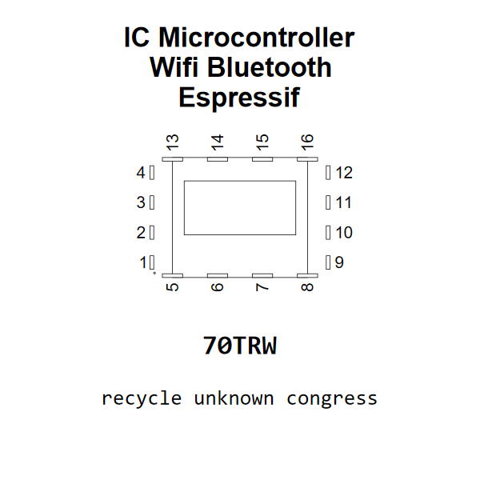

<!-- Generated item page. Full data lives in the source repository. -->
[Catalogue](../../../../../../../README.md) / [Electronic](../../../../../../README.md) / [IC](../../../../../README.md) / [Module Esp 12s](../../../../README.md) / [Microcontroller](../../../README.md) / [Wifi Bluetooth](../../README.md) / [Espressif](../README.md) / Esp 12s

# ⚡ IC Microcontroller Wifi Bluetooth Espressif MODULE_ESP_12S

> IC Microcontroller Wifi Bluetooth Espressif MODULE_ESP_12S is an OOMP electronic ic definition. It uses the module esp 12s package or form factor. Its nominal drawing size is 24.0 × 16.0 mm. The definition includes 16 documented pins.

[Full details →](https://github.com/oomlout/oomp_electronic_version_5/tree/main/parts/electronic_ic_module_esp_12s_microcontroller_wifi_bluetooth_espressif_esp_12s)

## At a glance

| Detail | Value |
| --- | --- |
| Type | Ic |
| Package / style | module esp 12s |
| Nominal size | 24.0 × 16.0 mm |
| Documented pins | 16 |
| OOMP ID | `electronic_ic_module_esp_12s_microcontroller_wifi_bluetooth_espressif_esp_12s` |

## Catalogue location

`Electronic › IC › Module Esp 12s › Microcontroller › Wifi Bluetooth › Espressif › Esp 12s`

## About this page

This is the compact catalogue view. A detailed source README is available. Schematics, fabrication data, working metadata, alternate diagrams, availability data, and project analysis stay with the [full original record](https://github.com/oomlout/oomp_electronic_version_5/tree/main/parts/electronic_ic_module_esp_12s_microcontroller_wifi_bluetooth_espressif_esp_12s).

---

[↑ Parent category](../README.md) · [Catalogue home](../../../../../../../README.md)
