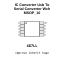

<!-- Generated item page. Full data lives in the source repository. -->
[Catalogue](../../../../../../../README.md) / [Electronic](../../../../../../README.md) / [IC](../../../../../README.md) / [Msop 10](../../../../README.md) / [Converter](../../../README.md) / [USB To Serial Converter](../../README.md) / [Wch](../README.md) / Ch340e

# ⚡ IC Converter Usb To Serial Converter Wch MSOP_10

> IC Converter Usb To Serial Converter Wch MSOP_10 is an OOMP electronic ic definition. It uses the msop 10 package or form factor. Its nominal drawing size is 3.0 × 3.0 mm. The definition includes 10 documented pins.

**[Full details →](https://github.com/oomlout/oomp_electronic_version_5/tree/main/parts/electronic_ic_msop_10_converter_usb_to_serial_converter_wch_ch340e)**

## At a glance

| Detail | Value |
| --- | --- |
| Type | Ic |
| Package / style | msop 10 |
| Nominal size | 3.0 × 3.0 mm |
| Documented pins | 10 |
| OOMP ID | `electronic_ic_msop_10_converter_usb_to_serial_converter_wch_ch340e` |

## Catalogue location

`Electronic › IC › Msop 10 › Converter › USB To Serial Converter › Wch › Ch340e`

## About this page

This is the compact catalogue view. A detailed source README is available. Schematics, fabrication data, working metadata, alternate diagrams, availability data, and project analysis stay with the [full original record](https://github.com/oomlout/oomp_electronic_version_5/tree/main/parts/electronic_ic_msop_10_converter_usb_to_serial_converter_wch_ch340e).

---

[↑ Parent category](../README.md) · [Catalogue home](../../../../../../../README.md)
