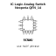

<!-- Generated item page. Full data lives in the source repository. -->
[Catalogue](../../../../../../../README.md) / [Electronic](../../../../../../README.md) / [IC](../../../../../README.md) / [Qfn 14](../../../../README.md) / [Logic](../../../README.md) / [Analog Switch](../../README.md) / [Nexperia](../README.md) / 74hc4066bq

# ⚡ IC Logic Analog Switch Nexperia QFN_14

> IC Logic Analog Switch Nexperia QFN_14 is an OOMP electronic ic definition. It uses the qfn 14 package or form factor. Its nominal drawing size is 3.0 × 3.0 mm. The definition includes 14 documented pins.

**[Full details →](https://github.com/oomlout/oomp_electronic_version_5/tree/main/parts/electronic_ic_qfn_14_logic_analog_switch_nexperia_74hc4066bq)**

## At a glance

| Detail | Value |
| --- | --- |
| Type | Ic |
| Package / style | qfn 14 |
| Nominal size | 3.0 × 3.0 mm |
| Documented pins | 14 |
| OOMP ID | `electronic_ic_qfn_14_logic_analog_switch_nexperia_74hc4066bq` |

## Catalogue location

`Electronic › IC › Qfn 14 › Logic › Analog Switch › Nexperia › 74hc4066bq`

## About this page

This is the compact catalogue view. A detailed source README is available. Schematics, fabrication data, working metadata, alternate diagrams, availability data, and project analysis stay with the [full original record](https://github.com/oomlout/oomp_electronic_version_5/tree/main/parts/electronic_ic_qfn_14_logic_analog_switch_nexperia_74hc4066bq).

---

[↑ Parent category](../README.md) · [Catalogue home](../../../../../../../README.md)
