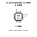

<!-- Generated item page. Full data lives in the source repository. -->
[Catalogue](../../../../../../../README.md) / [Electronic](../../../../../../README.md) / [IC](../../../../../README.md) / [Qfn 16 3 Mm X 3 Mm](../../../../README.md) / [Converter](../../../README.md) / [USB To Serial Converter](../../README.md) / [Wch](../README.md) / Ch343p

# ⚡ IC CH343P QFN 16 3 MM X 3 MM

> IC CH343P QFN 16 3 MM X 3 MM is an OOMP electronic ic definition. It uses the qfn 16 3 mm x 3 mm package or form factor. Its nominal drawing size is 3.0 × 3.0 mm. The definition includes 17 documented pins.

**[Full details →](https://github.com/oomlout/oomp_electronic_version_5/tree/main/parts/electronic_ic_qfn_16_3_mm_x_3_mm_converter_usb_to_serial_converter_wch_ch343p)**

## At a glance

| Detail | Value |
| --- | --- |
| Type | Ic |
| Package / style | qfn 16 3 mm x 3 mm |
| Nominal size | 3.0 × 3.0 mm |
| Documented pins | 17 |
| OOMP ID | `electronic_ic_qfn_16_3_mm_x_3_mm_converter_usb_to_serial_converter_wch_ch343p` |

## Catalogue location

`Electronic › IC › Qfn 16 3 Mm X 3 Mm › Converter › USB To Serial Converter › Wch › Ch343p`

## About this page

This is the compact catalogue view. A detailed source README is available. Schematics, fabrication data, working metadata, alternate diagrams, availability data, and project analysis stay with the [full original record](https://github.com/oomlout/oomp_electronic_version_5/tree/main/parts/electronic_ic_qfn_16_3_mm_x_3_mm_converter_usb_to_serial_converter_wch_ch343p).

---

[↑ Parent category](../README.md) · [Catalogue home](../../../../../../../README.md)
