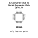

<!-- Generated item page. Full data lives in the source repository. -->
[Catalogue](../../../../../../../README.md) / [Electronic](../../../../../../README.md) / [IC](../../../../../README.md) / [Qfn 24](../../../../README.md) / [Converter](../../../README.md) / [USB To Serial Converter](../../README.md) / [Wch](../README.md) / Ch342f

# ⚡ IC Converter Usb To Serial Converter Wch QFN_24

> IC Converter Usb To Serial Converter Wch QFN_24 is an OOMP electronic ic definition. It uses the qfn 24 package or form factor. Its nominal drawing size is 4.0 × 4.0 mm. The definition includes 24 documented pins.

**[Full details →](https://github.com/oomlout/oomp_electronic_version_5/tree/main/parts/electronic_ic_qfn_24_converter_usb_to_serial_converter_wch_ch342f)**

## At a glance

| Detail | Value |
| --- | --- |
| Type | Ic |
| Package / style | qfn 24 |
| Nominal size | 4.0 × 4.0 mm |
| Documented pins | 24 |
| OOMP ID | `electronic_ic_qfn_24_converter_usb_to_serial_converter_wch_ch342f` |

## Catalogue location

`Electronic › IC › Qfn 24 › Converter › USB To Serial Converter › Wch › Ch342f`

## About this page

This is the compact catalogue view. A detailed source README is available. Schematics, fabrication data, working metadata, alternate diagrams, availability data, and project analysis stay with the [full original record](https://github.com/oomlout/oomp_electronic_version_5/tree/main/parts/electronic_ic_qfn_24_converter_usb_to_serial_converter_wch_ch342f).

---

[↑ Parent category](../README.md) · [Catalogue home](../../../../../../../README.md)
