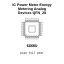

<!-- Generated item page. Full data lives in the source repository. -->
[Catalogue](../../../../../../../README.md) / [Electronic](../../../../../../README.md) / [IC](../../../../../README.md) / [Qfn 28](../../../../README.md) / [Power Meter](../../../README.md) / [Energy Metering](../../README.md) / [Analog Devices](../README.md) / Ade7953acpz

# ⚡ IC Power Meter Energy Metering Analog Devices QFN_28

> IC Power Meter Energy Metering Analog Devices QFN_28 is an OOMP electronic ic definition. It uses the qfn 28 package or form factor. Its nominal drawing size is 5.0 × 5.0 mm. The definition includes 28 documented pins.

**[Full details →](https://github.com/oomlout/oomp_electronic_version_5/tree/main/parts/electronic_ic_qfn_28_power_meter_energy_metering_analog_devices_ade7953acpz)**

## At a glance

| Detail | Value |
| --- | --- |
| Type | Ic |
| Package / style | qfn 28 |
| Nominal size | 5.0 × 5.0 mm |
| Documented pins | 28 |
| OOMP ID | `electronic_ic_qfn_28_power_meter_energy_metering_analog_devices_ade7953acpz` |

## Catalogue location

`Electronic › IC › Qfn 28 › Power Meter › Energy Metering › Analog Devices › Ade7953acpz`

## About this page

This is the compact catalogue view. A detailed source README is available. Schematics, fabrication data, working metadata, alternate diagrams, availability data, and project analysis stay with the [full original record](https://github.com/oomlout/oomp_electronic_version_5/tree/main/parts/electronic_ic_qfn_28_power_meter_energy_metering_analog_devices_ade7953acpz).

---

[↑ Parent category](../README.md) · [Catalogue home](../../../../../../../README.md)
