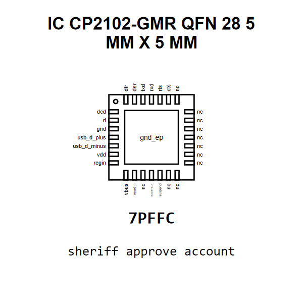

<!-- Generated item page. Full data lives in the source repository. -->
[Catalogue](../../../../../../../README.md) / [Electronic](../../../../../../README.md) / [IC](../../../../../README.md) / [Qfn 28 5 Mm X 5 Mm](../../../../README.md) / [Converter](../../../README.md) / [USB To Serial Converter](../../README.md) / [Silicon Labs](../README.md) / Cp2102 Gmr

# ⚡ IC CP2102-GMR QFN 28 5 MM X 5 MM

> IC CP2102-GMR QFN 28 5 MM X 5 MM is an OOMP electronic ic definition. It uses the qfn 28 5 mm x 5 mm package or form factor. Its nominal drawing size is 5.0 × 5.0 mm. The definition includes 29 documented pins.

[Full details →](https://github.com/oomlout/oomp_electronic_version_5/tree/main/parts/electronic_ic_qfn_28_5_mm_x_5_mm_converter_usb_to_serial_converter_silicon_labs_cp2102_gmr)

## At a glance

| Detail | Value |
| --- | --- |
| Type | Ic |
| Package / style | qfn 28 5 mm x 5 mm |
| Nominal size | 5.0 × 5.0 mm |
| Documented pins | 29 |
| OOMP ID | `electronic_ic_qfn_28_5_mm_x_5_mm_converter_usb_to_serial_converter_silicon_labs_cp2102_gmr` |

## Catalogue location

`Electronic › IC › Qfn 28 5 Mm X 5 Mm › Converter › USB To Serial Converter › Silicon Labs › Cp2102 Gmr`

## About this page

This is the compact catalogue view. A detailed source README is available. Schematics, fabrication data, working metadata, alternate diagrams, availability data, and project analysis stay with the [full original record](https://github.com/oomlout/oomp_electronic_version_5/tree/main/parts/electronic_ic_qfn_28_5_mm_x_5_mm_converter_usb_to_serial_converter_silicon_labs_cp2102_gmr).

---

[↑ Parent category](../README.md) · [Catalogue home](../../../../../../../README.md)
