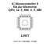

<!-- Generated item page. Full data lives in the source repository. -->
[Catalogue](../../../../../../../README.md) / [Electronic](../../../../../../README.md) / [IC](../../../../../README.md) / [Qfn 32 5 Mm X 5 Mm](../../../../README.md) / [Microcontroller](../../../README.md) / [8 Bit Avr](../../README.md) / [Microchip](../README.md) / Atmega328p Mu

# ⚡ IC Microcontroller 8 Bit Avr Microchip QFN_32_5_MM_X_5_MM

> IC Microcontroller 8 Bit Avr Microchip QFN_32_5_MM_X_5_MM is an OOMP electronic ic definition. It uses the qfn 32 5 mm x 5 mm package or form factor. Its nominal drawing size is 5.0 × 5.0 mm. The definition includes 32 documented pins.

**[Full details →](https://github.com/oomlout/oomp_electronic_version_5/tree/main/parts/electronic_ic_qfn_32_5_mm_x_5_mm_microcontroller_8_bit_avr_microchip_atmega328p_mu)**

## At a glance

| Detail | Value |
| --- | --- |
| Type | Ic |
| Package / style | qfn 32 5 mm x 5 mm |
| Nominal size | 5.0 × 5.0 mm |
| Documented pins | 32 |
| OOMP ID | `electronic_ic_qfn_32_5_mm_x_5_mm_microcontroller_8_bit_avr_microchip_atmega328p_mu` |

## Catalogue location

`Electronic › IC › Qfn 32 5 Mm X 5 Mm › Microcontroller › 8 Bit Avr › Microchip › Atmega328p Mu`

## About this page

This is the compact catalogue view. A detailed source README is available. Schematics, fabrication data, working metadata, alternate diagrams, availability data, and project analysis stay with the [full original record](https://github.com/oomlout/oomp_electronic_version_5/tree/main/parts/electronic_ic_qfn_32_5_mm_x_5_mm_microcontroller_8_bit_avr_microchip_atmega328p_mu).

---

[↑ Parent category](../README.md) · [Catalogue home](../../../../../../../README.md)
