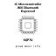

<!-- Generated item page. Full data lives in the source repository. -->
[Catalogue](../../../../../../../README.md) / [Electronic](../../../../../../README.md) / [IC](../../../../../README.md) / [Qfn 33 5 Mm X 5 Mm](../../../../README.md) / [Microcontroller](../../../README.md) / [Wifi Bluetooth](../../README.md) / [Espressif](../README.md) / Esp8285h16

# ⚡ IC Microcontroller Wifi Bluetooth Espressif QFN_33_5_MM_X_5_MM

> IC Microcontroller Wifi Bluetooth Espressif QFN_33_5_MM_X_5_MM is an OOMP electronic ic definition. It uses the qfn 33 5 mm x 5 mm package or form factor. Its nominal drawing size is 5.0 × 5.0 mm. The definition includes 33 documented pins.

**[Full details →](https://github.com/oomlout/oomp_electronic_version_5/tree/main/parts/electronic_ic_qfn_33_5_mm_x_5_mm_microcontroller_wifi_bluetooth_espressif_esp8285h16)**

## At a glance

| Detail | Value |
| --- | --- |
| Type | Ic |
| Package / style | qfn 33 5 mm x 5 mm |
| Nominal size | 5.0 × 5.0 mm |
| Documented pins | 33 |
| OOMP ID | `electronic_ic_qfn_33_5_mm_x_5_mm_microcontroller_wifi_bluetooth_espressif_esp8285h16` |

## Catalogue location

`Electronic › IC › Qfn 33 5 Mm X 5 Mm › Microcontroller › Wifi Bluetooth › Espressif › Esp8285h16`

## About this page

This is the compact catalogue view. A detailed source README is available. Schematics, fabrication data, working metadata, alternate diagrams, availability data, and project analysis stay with the [full original record](https://github.com/oomlout/oomp_electronic_version_5/tree/main/parts/electronic_ic_qfn_33_5_mm_x_5_mm_microcontroller_wifi_bluetooth_espressif_esp8285h16).

---

[↑ Parent category](../README.md) · [Catalogue home](../../../../../../../README.md)
