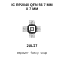

<!-- Generated item page. Full data lives in the source repository. -->
[Catalogue](../../../../../../../README.md) / [Electronic](../../../../../../README.md) / [IC](../../../../../README.md) / [Qfn 56 7 Mm X 7 Mm](../../../../README.md) / [Microcontroller](../../../README.md) / [Dual Core Arm Cortex M0 Plus](../../README.md) / [Raspberry Pi](../README.md) / Rp2040

# ⚡ IC RP2040 QFN 56 7 MM X 7 MM

> IC RP2040 QFN 56 7 MM X 7 MM is an OOMP electronic ic definition. It uses the qfn 56 7 mm x 7 mm package or form factor. Its nominal drawing size is 7.0 × 7.0 mm. The definition includes 57 documented pins.

**[Full details →](https://github.com/oomlout/oomp_electronic_version_5/tree/main/parts/electronic_ic_qfn_56_7_mm_x_7_mm_microcontroller_dual_core_arm_cortex_m0_plus_raspberry_pi_rp2040)**

## At a glance

| Detail | Value |
| --- | --- |
| Type | Ic |
| Package / style | qfn 56 7 mm x 7 mm |
| Nominal size | 7.0 × 7.0 mm |
| Documented pins | 57 |
| OOMP ID | `electronic_ic_qfn_56_7_mm_x_7_mm_microcontroller_dual_core_arm_cortex_m0_plus_raspberry_pi_rp2040` |

## Catalogue location

`Electronic › IC › Qfn 56 7 Mm X 7 Mm › Microcontroller › Dual Core Arm Cortex M0 Plus › Raspberry Pi › Rp2040`

## About this page

This is the compact catalogue view. A detailed source README is available. Schematics, fabrication data, working metadata, alternate diagrams, availability data, and project analysis stay with the [full original record](https://github.com/oomlout/oomp_electronic_version_5/tree/main/parts/electronic_ic_qfn_56_7_mm_x_7_mm_microcontroller_dual_core_arm_cortex_m0_plus_raspberry_pi_rp2040).

---

[↑ Parent category](../README.md) · [Catalogue home](../../../../../../../README.md)
