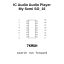

<!-- Generated item page. Full data lives in the source repository. -->
[Catalogue](../../../../../../../README.md) / [Electronic](../../../../../../README.md) / [IC](../../../../../README.md) / [So 16](../../../../README.md) / [Audio](../../../README.md) / [Audio Player](../../README.md) / [My Semi](../README.md) / My1690x 16s

# ⚡ IC Audio Audio Player My Semi SO_16

> IC Audio Audio Player My Semi SO_16 is an OOMP electronic ic definition. It uses the so 16 package or form factor. Its nominal drawing size is 10.0 × 4.0 mm. The definition includes 16 documented pins.

**[Full details →](https://github.com/oomlout/oomp_electronic_version_5/tree/main/parts/electronic_ic_so_16_audio_audio_player_my_semi_my1690x_16s)**

## At a glance

| Detail | Value |
| --- | --- |
| Type | Ic |
| Package / style | so 16 |
| Nominal size | 10.0 × 4.0 mm |
| Documented pins | 16 |
| OOMP ID | `electronic_ic_so_16_audio_audio_player_my_semi_my1690x_16s` |

## Catalogue location

`Electronic › IC › So 16 › Audio › Audio Player › My Semi › My1690x 16s`

## About this page

This is the compact catalogue view. A detailed source README is available. Schematics, fabrication data, working metadata, alternate diagrams, availability data, and project analysis stay with the [full original record](https://github.com/oomlout/oomp_electronic_version_5/tree/main/parts/electronic_ic_so_16_audio_audio_player_my_semi_my1690x_16s).

---

[↑ Parent category](../README.md) · [Catalogue home](../../../../../../../README.md)
