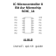

<!-- Generated item page. Full data lives in the source repository. -->
[Catalogue](../../../../../../../README.md) / [Electronic](../../../../../../README.md) / [IC](../../../../../README.md) / [Soic 14](../../../../README.md) / [Microcontroller](../../../README.md) / [8 Bit Avr](../../README.md) / [Microchip](../README.md) / Attiny404 Ssnr

# ⚡ IC Microcontroller 8 Bit Avr Microchip SOIC_14

> IC Microcontroller 8 Bit Avr Microchip SOIC_14 is an OOMP electronic ic definition. It uses the soic 14 package or form factor. Its nominal drawing size is 8.69 × 3.9 mm. The definition includes 14 documented pins.

**[Full details →](https://github.com/oomlout/oomp_electronic_version_5/tree/main/parts/electronic_ic_soic_14_microcontroller_8_bit_avr_microchip_attiny404_ssnr)**

## At a glance

| Detail | Value |
| --- | --- |
| Type | Ic |
| Package / style | soic 14 |
| Nominal size | 8.69 × 3.9 mm |
| Documented pins | 14 |
| OOMP ID | `electronic_ic_soic_14_microcontroller_8_bit_avr_microchip_attiny404_ssnr` |

## Catalogue location

`Electronic › IC › Soic 14 › Microcontroller › 8 Bit Avr › Microchip › Attiny404 Ssnr`

## About this page

This is the compact catalogue view. A detailed source README is available. Schematics, fabrication data, working metadata, alternate diagrams, availability data, and project analysis stay with the [full original record](https://github.com/oomlout/oomp_electronic_version_5/tree/main/parts/electronic_ic_soic_14_microcontroller_8_bit_avr_microchip_attiny404_ssnr).

---

[↑ Parent category](../README.md) · [Catalogue home](../../../../../../../README.md)
