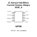

<!-- Generated item page. Full data lives in the source repository. -->
[Catalogue](../../../../../../../README.md) / [Electronic](../../../../../../README.md) / [IC](../../../../../README.md) / [Soic 8](../../../../README.md) / [Sensor](../../../README.md) / [Hall Effect Current Sensor](../../README.md) / [Allegro](../README.md) / Acs712

# ⚡ IC Sensor Hall Effect Current Sensor Allegro SOIC_8

> IC Sensor Hall Effect Current Sensor Allegro SOIC_8 is an OOMP electronic ic definition. It uses the soic 8 package or form factor. Its nominal drawing size is 4.9 × 3.9 mm. The definition includes 8 documented pins.

**[Full details →](https://github.com/oomlout/oomp_electronic_version_5/tree/main/parts/electronic_ic_soic_8_sensor_hall_effect_current_sensor_allegro_acs712)**

## At a glance

| Detail | Value |
| --- | --- |
| Type | Ic |
| Package / style | soic 8 |
| Nominal size | 4.9 × 3.9 mm |
| Documented pins | 8 |
| OOMP ID | `electronic_ic_soic_8_sensor_hall_effect_current_sensor_allegro_acs712` |

## Catalogue location

`Electronic › IC › Soic 8 › Sensor › Hall Effect Current Sensor › Allegro › Acs712`

## About this page

This is the compact catalogue view. A detailed source README is available. Schematics, fabrication data, working metadata, alternate diagrams, availability data, and project analysis stay with the [full original record](https://github.com/oomlout/oomp_electronic_version_5/tree/main/parts/electronic_ic_soic_8_sensor_hall_effect_current_sensor_allegro_acs712).

---

[↑ Parent category](../README.md) · [Catalogue home](../../../../../../../README.md)
