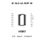

<!-- Generated item page. Full data lives in the source repository. -->
[Catalogue](../../../../../../../README.md) / [Electronic](../../../../../../README.md) / [IC](../../../../../README.md) / [Sop 16](../../../../README.md) / [Controller](../../../README.md) / [USB Hub Controller 4 Port](../../README.md) / [Corechips](../README.md) / Sl21a

# ⚡ IC SL2.1A SOP 16

> IC SL2.1A SOP 16 is an OOMP electronic ic definition. It uses the sop 16 package or form factor. Its nominal drawing size is 9.9 × 3.9 mm. The definition includes 16 documented pins.

**[Full details →](https://github.com/oomlout/oomp_electronic_version_5/tree/main/parts/electronic_ic_sop_16_controller_usb_hub_controller_4_port_corechips_sl21a)**

## At a glance

| Detail | Value |
| --- | --- |
| Type | Ic |
| Package / style | sop 16 |
| Nominal size | 9.9 × 3.9 mm |
| Documented pins | 16 |
| OOMP ID | `electronic_ic_sop_16_controller_usb_hub_controller_4_port_corechips_sl21a` |

## Catalogue location

`Electronic › IC › Sop 16 › Controller › USB Hub Controller 4 Port › Corechips › Sl21a`

## About this page

This is the compact catalogue view. A detailed source README is available. Schematics, fabrication data, working metadata, alternate diagrams, availability data, and project analysis stay with the [full original record](https://github.com/oomlout/oomp_electronic_version_5/tree/main/parts/electronic_ic_sop_16_controller_usb_hub_controller_4_port_corechips_sl21a).

---

[↑ Parent category](../README.md) · [Catalogue home](../../../../../../../README.md)
