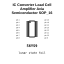

<!-- Generated item page. Full data lives in the source repository. -->
[Catalogue](../../../../../../../README.md) / [Electronic](../../../../../../README.md) / [IC](../../../../../README.md) / [Sop 16](../../../../README.md) / [Converter](../../../README.md) / [Load Cell Amplifier](../../README.md) / [Avia Semiconductor](../README.md) / Hx711

# ⚡ IC Converter Load Cell Amplifier Avia Semiconductor SOP_16

> IC Converter Load Cell Amplifier Avia Semiconductor SOP_16 is an OOMP electronic ic definition. It uses the sop 16 package or form factor. Its nominal drawing size is 9.9 × 3.9 mm.

**[Full details →](https://github.com/oomlout/oomp_electronic_version_5/tree/main/parts/electronic_ic_sop_16_converter_load_cell_amplifier_avia_semiconductor_hx711)**

## At a glance

| Detail | Value |
| --- | --- |
| Type | Ic |
| Package / style | sop 16 |
| Nominal size | 9.9 × 3.9 mm |
| OOMP ID | `electronic_ic_sop_16_converter_load_cell_amplifier_avia_semiconductor_hx711` |

## Catalogue location

`Electronic › IC › Sop 16 › Converter › Load Cell Amplifier › Avia Semiconductor › Hx711`

## About this page

This is the compact catalogue view. A detailed source README is available. Schematics, fabrication data, working metadata, alternate diagrams, availability data, and project analysis stay with the [full original record](https://github.com/oomlout/oomp_electronic_version_5/tree/main/parts/electronic_ic_sop_16_converter_load_cell_amplifier_avia_semiconductor_hx711).

---

[↑ Parent category](../README.md) · [Catalogue home](../../../../../../../README.md)
