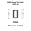

<!-- Generated item page. Full data lives in the source repository. -->
[Catalogue](../../../../../../../README.md) / [Electronic](../../../../../../README.md) / [IC](../../../../../README.md) / [Sop 16](../../../../README.md) / [Converter](../../../README.md) / [USB To Serial Converter](../../README.md) / [Wch](../README.md) / Ch340c

# ⚡ USB-Serial CH340C SOP-16

> USB-Serial CH340C SOP-16 is an OOMP electronic ic definition. It uses the sop 16 package or form factor. Its nominal drawing size is 9.9 × 3.9 mm.

**[Full details →](https://github.com/oomlout/oomp_electronic_version_5/tree/main/parts/electronic_ic_sop_16_converter_usb_to_serial_converter_wch_ch340c)**

## At a glance

| Detail | Value |
| --- | --- |
| Type | Ic |
| Package / style | sop 16 |
| Nominal size | 9.9 × 3.9 mm |
| OOMP ID | `electronic_ic_sop_16_converter_usb_to_serial_converter_wch_ch340c` |

## Catalogue location

`Electronic › IC › Sop 16 › Converter › USB To Serial Converter › Wch › Ch340c`

## About this page

This is the compact catalogue view. A detailed source README is available. Schematics, fabrication data, working metadata, alternate diagrams, availability data, and project analysis stay with the [full original record](https://github.com/oomlout/oomp_electronic_version_5/tree/main/parts/electronic_ic_sop_16_converter_usb_to_serial_converter_wch_ch340c).

---

[↑ Parent category](../README.md) · [Catalogue home](../../../../../../../README.md)
