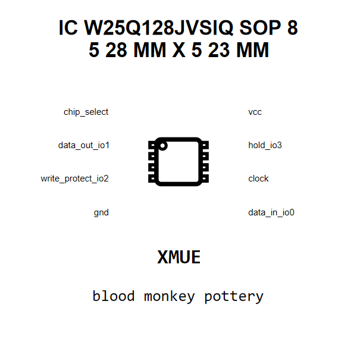

<!-- Generated item page. Full data lives in the source repository. -->
[Catalogue](../../../../../../../README.md) / [Electronic](../../../../../../README.md) / [IC](../../../../../README.md) / [Sop 8 5 28 Mm X 5 23 Mm](../../../../README.md) / [Memory](../../../README.md) / [Spi Nor Flash 128 Mbit](../../README.md) / [Winbond](../README.md) / W25q128jvsiq

# ⚡ IC W25Q128JVSIQ SOP 8 5 28 MM X 5 23 MM

> IC W25Q128JVSIQ SOP 8 5 28 MM X 5 23 MM is an OOMP electronic ic definition. It uses the sop 8 5 28 mm x 5 23 mm package or form factor. Its nominal drawing size is 5.28 × 5.23 mm. The definition includes 8 documented pins.

[Full details →](https://github.com/oomlout/oomp_electronic_version_5/tree/main/parts/electronic_ic_sop_8_5_28_mm_x_5_23_mm_memory_spi_nor_flash_128_mbit_winbond_w25q128jvsiq)

## At a glance

| Detail | Value |
| --- | --- |
| Type | Ic |
| Package / style | sop 8 5 28 mm x 5 23 mm |
| Nominal size | 5.28 × 5.23 mm |
| Documented pins | 8 |
| OOMP ID | `electronic_ic_sop_8_5_28_mm_x_5_23_mm_memory_spi_nor_flash_128_mbit_winbond_w25q128jvsiq` |

## Catalogue location

`Electronic › IC › Sop 8 5 28 Mm X 5 23 Mm › Memory › Spi Nor Flash 128 Mbit › Winbond › W25q128jvsiq`

## About this page

This is the compact catalogue view. A detailed source README is available. Schematics, fabrication data, working metadata, alternate diagrams, availability data, and project analysis stay with the [full original record](https://github.com/oomlout/oomp_electronic_version_5/tree/main/parts/electronic_ic_sop_8_5_28_mm_x_5_23_mm_memory_spi_nor_flash_128_mbit_winbond_w25q128jvsiq).

---

[↑ Parent category](../README.md) · [Catalogue home](../../../../../../../README.md)
