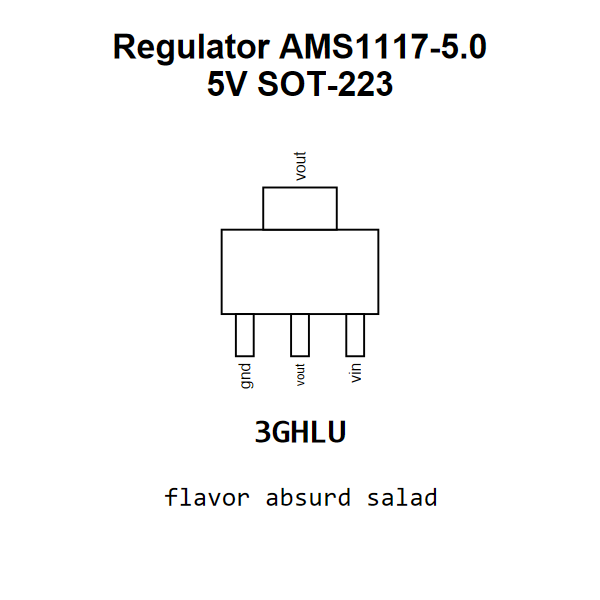

<!-- Generated item page. Full data lives in the source repository. -->
[Catalogue](../../../../../../../README.md) / [Electronic](../../../../../../README.md) / [IC](../../../../../README.md) / [Sot 223 3](../../../../README.md) / [Power Management](../../../README.md) / [Linear Voltage Regulator 5 Volt](../../README.md) / [Advanced Monolithic Systems](../README.md) / Ams1117 5

# ⚡ Regulator AMS1117-5.0 5V SOT-223

> Regulator AMS1117-5.0 5V SOT-223 is an OOMP electronic ic definition. It uses the sot 223 3 package or form factor. Its nominal drawing size is 6.5 × 7.0 mm. The definition includes 3 documented pins.

[Full details →](https://github.com/oomlout/oomp_electronic_version_5/tree/main/parts/electronic_ic_sot_223_3_power_management_linear_voltage_regulator_5_volt_advanced_monolithic_systems_ams1117_5)

## At a glance

| Detail | Value |
| --- | --- |
| Type | Ic |
| Package / style | sot 223 3 |
| Nominal size | 6.5 × 7.0 mm |
| Documented pins | 3 |
| OOMP ID | `electronic_ic_sot_223_3_power_management_linear_voltage_regulator_5_volt_advanced_monolithic_systems_ams1117_5` |

## Catalogue location

`Electronic › IC › Sot 223 3 › Power Management › Linear Voltage Regulator 5 Volt › Advanced Monolithic Systems › Ams1117 5`

## About this page

This is the compact catalogue view. A detailed source README is available. Schematics, fabrication data, working metadata, alternate diagrams, availability data, and project analysis stay with the [full original record](https://github.com/oomlout/oomp_electronic_version_5/tree/main/parts/electronic_ic_sot_223_3_power_management_linear_voltage_regulator_5_volt_advanced_monolithic_systems_ams1117_5).

---

[↑ Parent category](../README.md) · [Catalogue home](../../../../../../../README.md)
