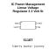

<!-- Generated item page. Full data lives in the source repository. -->
[Catalogue](../../../../../../../README.md) / [Electronic](../../../../../../README.md) / [IC](../../../../../README.md) / [Sot 223 4](../../../../README.md) / [Power Management](../../../README.md) / [Linear Voltage Regulator 3 3 Volt](../../README.md) / [St](../README.md) / Ld1117 3 3

# ⚡ IC Power Management Linear Voltage Regulator 3 3 Volt St SOT_223_4

> IC Power Management Linear Voltage Regulator 3 3 Volt St SOT_223_4 is an OOMP electronic ic definition. It uses the sot 223 4 package or form factor. Its nominal drawing size is 6.5 × 7.0 mm. The definition includes 4 documented pins.

**[Full details →](https://github.com/oomlout/oomp_electronic_version_5/tree/main/parts/electronic_ic_sot_223_4_power_management_linear_voltage_regulator_3_3_volt_st_ld1117_3_3)**

## At a glance

| Detail | Value |
| --- | --- |
| Type | Ic |
| Package / style | sot 223 4 |
| Nominal size | 6.5 × 7.0 mm |
| Documented pins | 4 |
| OOMP ID | `electronic_ic_sot_223_4_power_management_linear_voltage_regulator_3_3_volt_st_ld1117_3_3` |

## Catalogue location

`Electronic › IC › Sot 223 4 › Power Management › Linear Voltage Regulator 3 3 Volt › St › Ld1117 3 3`

## About this page

This is the compact catalogue view. A detailed source README is available. Schematics, fabrication data, working metadata, alternate diagrams, availability data, and project analysis stay with the [full original record](https://github.com/oomlout/oomp_electronic_version_5/tree/main/parts/electronic_ic_sot_223_4_power_management_linear_voltage_regulator_3_3_volt_st_ld1117_3_3).

---

[↑ Parent category](../README.md) · [Catalogue home](../../../../../../../README.md)
