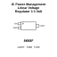

<!-- Generated item page. Full data lives in the source repository. -->
[Catalogue](../../../../../../../README.md) / [Electronic](../../../../../../README.md) / [IC](../../../../../README.md) / [Sot 23 3](../../../../README.md) / [Power Management](../../../README.md) / [Linear Voltage Regulator 3 3 Volt](../../README.md) / [Microchip](../README.md) / Mcp1700t 3302e Tt

# ⚡ IC Power Management Linear Voltage Regulator 3 3 Volt Microchip SOT_23_3

> IC Power Management Linear Voltage Regulator 3 3 Volt Microchip SOT_23_3 is an OOMP electronic ic definition. It uses the sot 23 3 package or form factor. Its nominal drawing size is 2.9 × 1.6 mm. The definition includes 3 documented pins.

**[Full details →](https://github.com/oomlout/oomp_electronic_version_5/tree/main/parts/electronic_ic_sot_23_3_power_management_linear_voltage_regulator_3_3_volt_microchip_mcp1700t_3302e_tt)**

## At a glance

| Detail | Value |
| --- | --- |
| Type | Ic |
| Package / style | sot 23 3 |
| Nominal size | 2.9 × 1.6 mm |
| Documented pins | 3 |
| OOMP ID | `electronic_ic_sot_23_3_power_management_linear_voltage_regulator_3_3_volt_microchip_mcp1700t_3302e_tt` |

## Catalogue location

`Electronic › IC › Sot 23 3 › Power Management › Linear Voltage Regulator 3 3 Volt › Microchip › Mcp1700t 3302e Tt`

## About this page

This is the compact catalogue view. A detailed source README is available. Schematics, fabrication data, working metadata, alternate diagrams, availability data, and project analysis stay with the [full original record](https://github.com/oomlout/oomp_electronic_version_5/tree/main/parts/electronic_ic_sot_23_3_power_management_linear_voltage_regulator_3_3_volt_microchip_mcp1700t_3302e_tt).

---

[↑ Parent category](../README.md) · [Catalogue home](../../../../../../../README.md)
