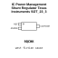

<!-- Generated item page. Full data lives in the source repository. -->
[Catalogue](../../../../../../../README.md) / [Electronic](../../../../../../README.md) / [IC](../../../../../README.md) / [Sot 23 3](../../../../README.md) / [Power Management](../../../README.md) / [Shunt Regulator](../../README.md) / [Texas Instruments](../README.md) / Tl431acdbz

# ⚡ IC Power Management Shunt Regulator Texas Instruments SOT_23_3

> IC Power Management Shunt Regulator Texas Instruments SOT_23_3 is an OOMP electronic ic definition. It uses the sot 23 3 package or form factor. Its nominal drawing size is 2.9 × 1.6 mm. The definition includes 3 documented pins.

**[Full details →](https://github.com/oomlout/oomp_electronic_version_5/tree/main/parts/electronic_ic_sot_23_3_power_management_shunt_regulator_texas_instruments_tl431acdbz)**

## At a glance

| Detail | Value |
| --- | --- |
| Type | Ic |
| Package / style | sot 23 3 |
| Nominal size | 2.9 × 1.6 mm |
| Documented pins | 3 |
| OOMP ID | `electronic_ic_sot_23_3_power_management_shunt_regulator_texas_instruments_tl431acdbz` |

## Catalogue location

`Electronic › IC › Sot 23 3 › Power Management › Shunt Regulator › Texas Instruments › Tl431acdbz`

## About this page

This is the compact catalogue view. A detailed source README is available. Schematics, fabrication data, working metadata, alternate diagrams, availability data, and project analysis stay with the [full original record](https://github.com/oomlout/oomp_electronic_version_5/tree/main/parts/electronic_ic_sot_23_3_power_management_shunt_regulator_texas_instruments_tl431acdbz).

---

[↑ Parent category](../README.md) · [Catalogue home](../../../../../../../README.md)
