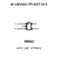

<!-- Generated item page. Full data lives in the source repository. -->
[Catalogue](../../../../../../../README.md) / [Electronic](../../../../../../README.md) / [IC](../../../../../README.md) / [Sot 23 5](../../../../README.md) / [Amplifier](../../../README.md) / [Operational Single Rail To Rail Input Output](../../README.md) / [Gainsil](../README.md) / Lmv321 Tr

# ⚡ IC LMV321-TR SOT 23 5

> IC LMV321-TR SOT 23 5 is an OOMP electronic ic definition. It uses the sot 23 5 package or form factor. Its nominal drawing size is 2.92 × 2.8 mm. The definition includes 5 documented pins.

**[Full details →](https://github.com/oomlout/oomp_electronic_version_5/tree/main/parts/electronic_ic_sot_23_5_amplifier_operational_single_rail_to_rail_input_output_gainsil_lmv321_tr)**

## At a glance

| Detail | Value |
| --- | --- |
| Type | Ic |
| Package / style | sot 23 5 |
| Nominal size | 2.92 × 2.8 mm |
| Documented pins | 5 |
| OOMP ID | `electronic_ic_sot_23_5_amplifier_operational_single_rail_to_rail_input_output_gainsil_lmv321_tr` |

## Catalogue location

`Electronic › IC › Sot 23 5 › Amplifier › Operational Single Rail To Rail Input Output › Gainsil › Lmv321 Tr`

## About this page

This is the compact catalogue view. A detailed source README is available. Schematics, fabrication data, working metadata, alternate diagrams, availability data, and project analysis stay with the [full original record](https://github.com/oomlout/oomp_electronic_version_5/tree/main/parts/electronic_ic_sot_23_5_amplifier_operational_single_rail_to_rail_input_output_gainsil_lmv321_tr).

---

[↑ Parent category](../README.md) · [Catalogue home](../../../../../../../README.md)
