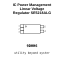

<!-- Generated item page. Full data lives in the source repository. -->
[Catalogue](../../../../../../README.md) / [Electronic](../../../../../README.md) / [IC](../../../../README.md) / [Sot 23 5](../../../README.md) / [Power Management](../../README.md) / [Linear Voltage Regulator](../README.md) / Se5218alg

# ⚡ IC Power Management Linear Voltage Regulator SE5218ALG SOT_23_5

> IC Power Management Linear Voltage Regulator SE5218ALG SOT_23_5 is an OOMP electronic ic definition. It uses the sot 23 5 package or form factor. Its nominal drawing size is 2.9 × 1.6 mm. The definition includes 5 documented pins.

**[Full details →](https://github.com/oomlout/oomp_electronic_version_5/tree/main/parts/electronic_ic_sot_23_5_power_management_linear_voltage_regulator_se5218alg)**

## At a glance

| Detail | Value |
| --- | --- |
| Type | Ic |
| Package / style | sot 23 5 |
| Nominal size | 2.9 × 1.6 mm |
| Documented pins | 5 |
| OOMP ID | `electronic_ic_sot_23_5_power_management_linear_voltage_regulator_se5218alg` |

## Catalogue location

`Electronic › IC › Sot 23 5 › Power Management › Linear Voltage Regulator › Se5218alg`

## About this page

This is the compact catalogue view. A detailed source README is available. Schematics, fabrication data, working metadata, alternate diagrams, availability data, and project analysis stay with the [full original record](https://github.com/oomlout/oomp_electronic_version_5/tree/main/parts/electronic_ic_sot_23_5_power_management_linear_voltage_regulator_se5218alg).

---

[↑ Parent category](../README.md) · [Catalogue home](../../../../../../README.md)
