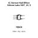

<!-- Generated item page. Full data lives in the source repository. -->
[Catalogue](../../../../../../../README.md) / [Electronic](../../../../../../README.md) / [IC](../../../../../README.md) / [Sot 23 5](../../../../README.md) / [Sensor](../../../README.md) / [Hall Effect](../../README.md) / [Silicon Labs](../README.md) / Si7211 B 00 Iv

# ⚡ IC Sensor Hall Effect Silicon Labs SOT_23_5

> IC Sensor Hall Effect Silicon Labs SOT_23_5 is an OOMP electronic ic definition. It uses the sot 23 5 package or form factor. Its nominal drawing size is 2.9 × 1.6 mm.

**[Full details →](https://github.com/oomlout/oomp_electronic_version_5/tree/main/parts/electronic_ic_sot_23_5_sensor_hall_effect_silicon_labs_si7211_b_00_iv)**

## At a glance

| Detail | Value |
| --- | --- |
| Type | Ic |
| Package / style | sot 23 5 |
| Nominal size | 2.9 × 1.6 mm |
| OOMP ID | `electronic_ic_sot_23_5_sensor_hall_effect_silicon_labs_si7211_b_00_iv` |

## Catalogue location

`Electronic › IC › Sot 23 5 › Sensor › Hall Effect › Silicon Labs › Si7211 B 00 Iv`

## About this page

This is the compact catalogue view. A detailed source README is available. Schematics, fabrication data, working metadata, alternate diagrams, availability data, and project analysis stay with the [full original record](https://github.com/oomlout/oomp_electronic_version_5/tree/main/parts/electronic_ic_sot_23_5_sensor_hall_effect_silicon_labs_si7211_b_00_iv).

---

[↑ Parent category](../README.md) · [Catalogue home](../../../../../../../README.md)
