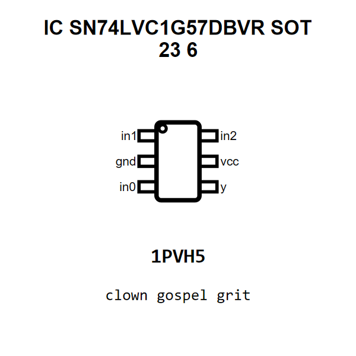

<!-- Generated item page. Full data lives in the source repository. -->
[Catalogue](../../../../../../../README.md) / [Electronic](../../../../../../README.md) / [IC](../../../../../README.md) / [Sot 23 6](../../../../README.md) / [Logic](../../../README.md) / [Configurable Multi Function Gate](../../README.md) / [Texas Instruments](../README.md) / Sn74lvc1g57dbvr

# ⚡ IC SN74LVC1G57DBVR SOT 23 6

> IC SN74LVC1G57DBVR SOT 23 6 is an OOMP electronic ic definition. It uses the sot 23 6 package or form factor. Its nominal drawing size is 2.9 × 1.6 mm. The definition includes 6 documented pins.

[Full details →](https://github.com/oomlout/oomp_electronic_version_5/tree/main/parts/electronic_ic_sot_23_6_logic_configurable_multi_function_gate_texas_instruments_sn74lvc1g57dbvr)

## At a glance

| Detail | Value |
| --- | --- |
| Type | Ic |
| Package / style | sot 23 6 |
| Nominal size | 2.9 × 1.6 mm |
| Documented pins | 6 |
| OOMP ID | `electronic_ic_sot_23_6_logic_configurable_multi_function_gate_texas_instruments_sn74lvc1g57dbvr` |

## Catalogue location

`Electronic › IC › Sot 23 6 › Logic › Configurable Multi Function Gate › Texas Instruments › Sn74lvc1g57dbvr`

## About this page

This is the compact catalogue view. A detailed source README is available. Schematics, fabrication data, working metadata, alternate diagrams, availability data, and project analysis stay with the [full original record](https://github.com/oomlout/oomp_electronic_version_5/tree/main/parts/electronic_ic_sot_23_6_logic_configurable_multi_function_gate_texas_instruments_sn74lvc1g57dbvr).

---

[↑ Parent category](../README.md) · [Catalogue home](../../../../../../../README.md)
