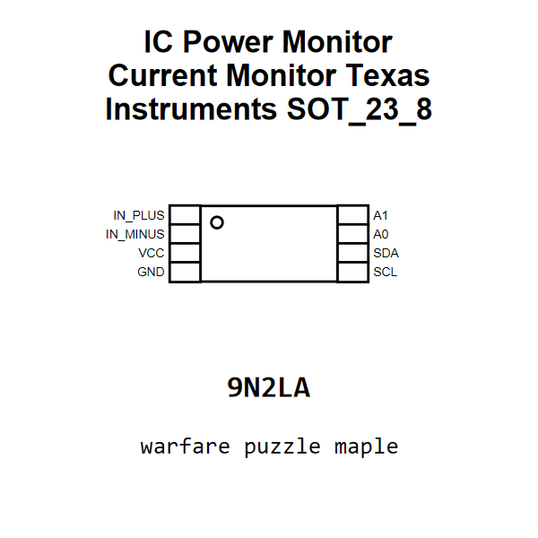

<!-- Generated item page. Full data lives in the source repository. -->
[Catalogue](../../../../../../../README.md) / [Electronic](../../../../../../README.md) / [IC](../../../../../README.md) / [Sot 23 8](../../../../README.md) / [Power Monitor](../../../README.md) / [Current Monitor](../../README.md) / [Texas Instruments](../README.md) / Ina219

# ⚡ IC Power Monitor Current Monitor Texas Instruments SOT_23_8

> IC Power Monitor Current Monitor Texas Instruments SOT_23_8 is an OOMP electronic ic definition. It uses the sot 23 8 package or form factor. Its nominal drawing size is 2.9 × 1.6 mm. The definition includes 8 documented pins.

[Full details →](https://github.com/oomlout/oomp_electronic_version_5/tree/main/parts/electronic_ic_sot_23_8_power_monitor_current_monitor_texas_instruments_ina219)

## At a glance

| Detail | Value |
| --- | --- |
| Type | Ic |
| Package / style | sot 23 8 |
| Nominal size | 2.9 × 1.6 mm |
| Documented pins | 8 |
| OOMP ID | `electronic_ic_sot_23_8_power_monitor_current_monitor_texas_instruments_ina219` |

## Catalogue location

`Electronic › IC › Sot 23 8 › Power Monitor › Current Monitor › Texas Instruments › Ina219`

## About this page

This is the compact catalogue view. A detailed source README is available. Schematics, fabrication data, working metadata, alternate diagrams, availability data, and project analysis stay with the [full original record](https://github.com/oomlout/oomp_electronic_version_5/tree/main/parts/electronic_ic_sot_23_8_power_monitor_current_monitor_texas_instruments_ina219).

---

[↑ Parent category](../README.md) · [Catalogue home](../../../../../../../README.md)
