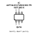

<!-- Generated item page. Full data lives in the source repository. -->
[Catalogue](../../../../../../../README.md) / [Electronic](../../../../../../README.md) / [IC](../../../../../README.md) / [Sot 363 6](../../../../README.md) / [Logic](../../../README.md) / [Single Bit Dual Supply Transceiver](../../README.md) / [Wuxi I Core Elec](../README.md) / Aip74lvc1t45gc363 Tr

# ⚡ IC AiP74LVC1T45GC363.TR SOT 363 6

> IC AiP74LVC1T45GC363.TR SOT 363 6 is an OOMP electronic ic definition. It uses the sot 363 6 package or form factor. Its nominal drawing size is 2.0 × 1.25 mm. The definition includes 6 documented pins.

**[Full details →](https://github.com/oomlout/oomp_electronic_version_5/tree/main/parts/electronic_ic_sot_363_6_logic_single_bit_dual_supply_transceiver_wuxi_i_core_elec_aip74lvc1t45gc363_tr)**

## At a glance

| Detail | Value |
| --- | --- |
| Type | Ic |
| Package / style | sot 363 6 |
| Nominal size | 2.0 × 1.25 mm |
| Documented pins | 6 |
| OOMP ID | `electronic_ic_sot_363_6_logic_single_bit_dual_supply_transceiver_wuxi_i_core_elec_aip74lvc1t45gc363_tr` |

## Catalogue location

`Electronic › IC › Sot 363 6 › Logic › Single Bit Dual Supply Transceiver › Wuxi I Core Elec › Aip74lvc1t45gc363 Tr`

## About this page

This is the compact catalogue view. A detailed source README is available. Schematics, fabrication data, working metadata, alternate diagrams, availability data, and project analysis stay with the [full original record](https://github.com/oomlout/oomp_electronic_version_5/tree/main/parts/electronic_ic_sot_363_6_logic_single_bit_dual_supply_transceiver_wuxi_i_core_elec_aip74lvc1t45gc363_tr).

---

[↑ Parent category](../README.md) · [Catalogue home](../../../../../../../README.md)
