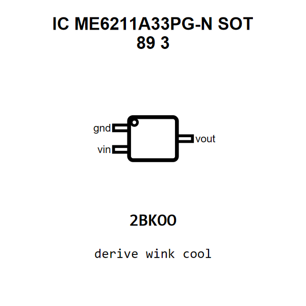

<!-- Generated item page. Full data lives in the source repository. -->
[Catalogue](../../../../../../../README.md) / [Electronic](../../../../../../README.md) / [IC](../../../../../README.md) / [Sot 89 3](../../../../README.md) / [Power Management](../../../README.md) / [Linear Voltage Regulator 3 3 Volt](../../README.md) / [Microne](../README.md) / Me6211a33pg N

# ⚡ IC ME6211A33PG-N SOT 89 3

> IC ME6211A33PG-N SOT 89 3 is an OOMP electronic ic definition. It uses the sot 89 3 package or form factor. Its nominal drawing size is 4.5 × 2.5 mm. The definition includes 3 documented pins.

[Full details →](https://github.com/oomlout/oomp_electronic_version_5/tree/main/parts/electronic_ic_sot_89_3_power_management_linear_voltage_regulator_3_3_volt_microne_me6211a33pg_n)

## At a glance

| Detail | Value |
| --- | --- |
| Type | Ic |
| Package / style | sot 89 3 |
| Nominal size | 4.5 × 2.5 mm |
| Documented pins | 3 |
| OOMP ID | `electronic_ic_sot_89_3_power_management_linear_voltage_regulator_3_3_volt_microne_me6211a33pg_n` |

## Catalogue location

`Electronic › IC › Sot 89 3 › Power Management › Linear Voltage Regulator 3 3 Volt › Microne › Me6211a33pg N`

## About this page

This is the compact catalogue view. A detailed source README is available. Schematics, fabrication data, working metadata, alternate diagrams, availability data, and project analysis stay with the [full original record](https://github.com/oomlout/oomp_electronic_version_5/tree/main/parts/electronic_ic_sot_89_3_power_management_linear_voltage_regulator_3_3_volt_microne_me6211a33pg_n).

---

[↑ Parent category](../README.md) · [Catalogue home](../../../../../../../README.md)
