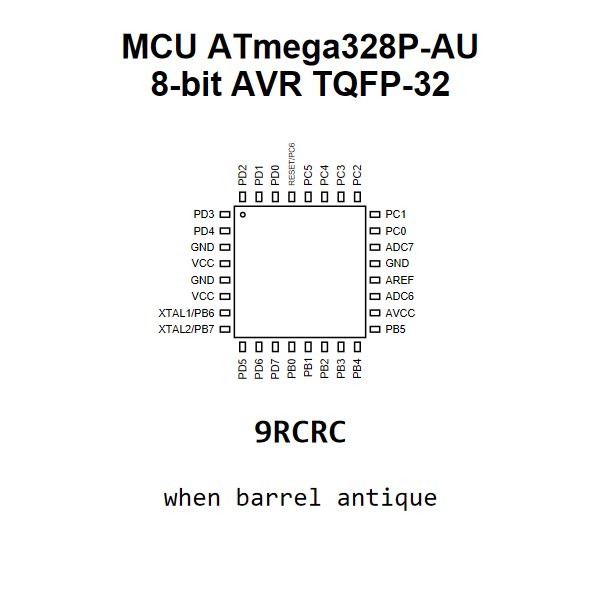

<!-- Generated item page. Full data lives in the source repository. -->
[Catalogue](../../../../../../../README.md) / [Electronic](../../../../../../README.md) / [IC](../../../../../README.md) / [Tqfp 32 7 Mm X 7 Mm](../../../../README.md) / [Microcontroller](../../../README.md) / [8 Bit Avr](../../README.md) / [Microchip](../README.md) / Atmega328p Au

# ⚡ MCU ATmega328P-AU 8-bit AVR TQFP-32

> MCU ATmega328P-AU 8-bit AVR TQFP-32 is an OOMP electronic ic definition. It uses the tqfp 32 7 mm x 7 mm package or form factor. Its nominal drawing size is 9.0 × 9.0 mm. The definition includes 32 documented pins.

[Full details →](https://github.com/oomlout/oomp_electronic_version_5/tree/main/parts/electronic_ic_tqfp_32_7_mm_x_7_mm_microcontroller_8_bit_avr_microchip_atmega328p_au)

## At a glance

| Detail | Value |
| --- | --- |
| Type | Ic |
| Package / style | tqfp 32 7 mm x 7 mm |
| Nominal size | 9.0 × 9.0 mm |
| Documented pins | 32 |
| OOMP ID | `electronic_ic_tqfp_32_7_mm_x_7_mm_microcontroller_8_bit_avr_microchip_atmega328p_au` |

## Catalogue location

`Electronic › IC › Tqfp 32 7 Mm X 7 Mm › Microcontroller › 8 Bit Avr › Microchip › Atmega328p Au`

## About this page

This is the compact catalogue view. A detailed source README is available. Schematics, fabrication data, working metadata, alternate diagrams, availability data, and project analysis stay with the [full original record](https://github.com/oomlout/oomp_electronic_version_5/tree/main/parts/electronic_ic_tqfp_32_7_mm_x_7_mm_microcontroller_8_bit_avr_microchip_atmega328p_au).

---

[↑ Parent category](../README.md) · [Catalogue home](../../../../../../../README.md)
