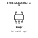

<!-- Generated item page. Full data lives in the source repository. -->
[Catalogue](../../../../../../../README.md) / [Electronic](../../../../../../README.md) / [IC](../../../../../README.md) / [Tsot 23 5](../../../../README.md) / [Power Management](../../../README.md) / [High Side Power Switch With Flag](../../README.md) / [Richtek](../README.md) / Rt9742cgj5

# ⚡ IC RT9742CGJ5 TSOT 23 5

> IC RT9742CGJ5 TSOT 23 5 is an OOMP electronic ic definition. It uses the tsot 23 5 package or form factor. Its nominal drawing size is 2.9 × 1.6 mm. The definition includes 5 documented pins.

**[Full details →](https://github.com/oomlout/oomp_electronic_version_5/tree/main/parts/electronic_ic_tsot_23_5_power_management_high_side_power_switch_with_flag_richtek_rt9742cgj5)**

## At a glance

| Detail | Value |
| --- | --- |
| Type | Ic |
| Package / style | tsot 23 5 |
| Nominal size | 2.9 × 1.6 mm |
| Documented pins | 5 |
| OOMP ID | `electronic_ic_tsot_23_5_power_management_high_side_power_switch_with_flag_richtek_rt9742cgj5` |

## Catalogue location

`Electronic › IC › Tsot 23 5 › Power Management › High Side Power Switch With Flag › Richtek › Rt9742cgj5`

## About this page

This is the compact catalogue view. A detailed source README is available. Schematics, fabrication data, working metadata, alternate diagrams, availability data, and project analysis stay with the [full original record](https://github.com/oomlout/oomp_electronic_version_5/tree/main/parts/electronic_ic_tsot_23_5_power_management_high_side_power_switch_with_flag_richtek_rt9742cgj5).

---

[↑ Parent category](../README.md) · [Catalogue home](../../../../../../../README.md)
