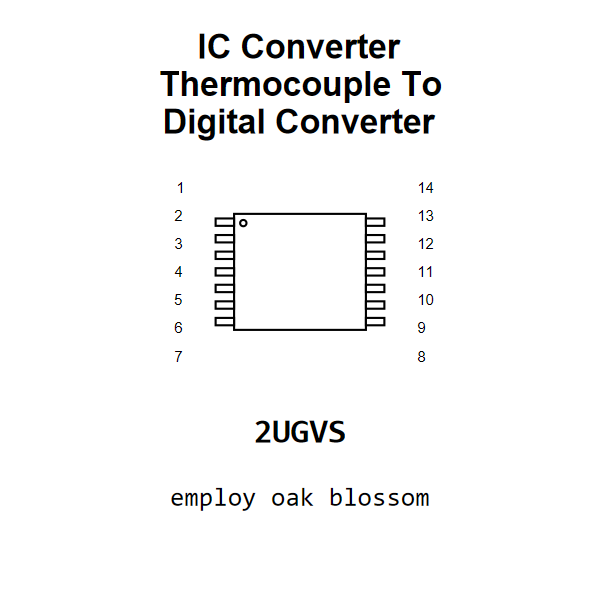

<!-- Generated item page. Full data lives in the source repository. -->
[Catalogue](../../../../../../../README.md) / [Electronic](../../../../../../README.md) / [IC](../../../../../README.md) / [Tssop 14](../../../../README.md) / [Converter](../../../README.md) / [Thermocouple To Digital Converter](../../README.md) / [Maxim](../README.md) / Max31856

# ⚡ IC Converter Thermocouple To Digital Converter Maxim TSSOP_14

> IC Converter Thermocouple To Digital Converter Maxim TSSOP_14 is an OOMP electronic ic definition. It uses the tssop 14 package or form factor. Its nominal drawing size is 5.0 × 4.4 mm. The definition includes 14 documented pins.

[Full details →](https://github.com/oomlout/oomp_electronic_version_5/tree/main/parts/electronic_ic_tssop_14_converter_thermocouple_to_digital_converter_maxim_max31856)

## At a glance

| Detail | Value |
| --- | --- |
| Type | Ic |
| Package / style | tssop 14 |
| Nominal size | 5.0 × 4.4 mm |
| Documented pins | 14 |
| OOMP ID | `electronic_ic_tssop_14_converter_thermocouple_to_digital_converter_maxim_max31856` |

## Catalogue location

`Electronic › IC › Tssop 14 › Converter › Thermocouple To Digital Converter › Maxim › Max31856`

## About this page

This is the compact catalogue view. A detailed source README is available. Schematics, fabrication data, working metadata, alternate diagrams, availability data, and project analysis stay with the [full original record](https://github.com/oomlout/oomp_electronic_version_5/tree/main/parts/electronic_ic_tssop_14_converter_thermocouple_to_digital_converter_maxim_max31856).

---

[↑ Parent category](../README.md) · [Catalogue home](../../../../../../../README.md)
