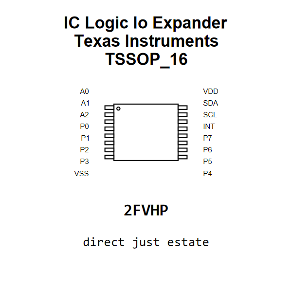

<!-- Generated item page. Full data lives in the source repository. -->
[Catalogue](../../../../../../../README.md) / [Electronic](../../../../../../README.md) / [IC](../../../../../README.md) / [Tssop 16](../../../../README.md) / [Logic](../../../README.md) / [Io Expander](../../README.md) / [Texas Instruments](../README.md) / Pca9554pw

# ⚡ IC Logic Io Expander Texas Instruments TSSOP_16

> IC Logic Io Expander Texas Instruments TSSOP_16 is an OOMP electronic ic definition. It uses the tssop 16 package or form factor. Its nominal drawing size is 5.0 × 4.4 mm. The definition includes 16 documented pins.

[Full details →](https://github.com/oomlout/oomp_electronic_version_5/tree/main/parts/electronic_ic_tssop_16_logic_io_expander_texas_instruments_pca9554pw)

## At a glance

| Detail | Value |
| --- | --- |
| Type | Ic |
| Package / style | tssop 16 |
| Nominal size | 5.0 × 4.4 mm |
| Documented pins | 16 |
| OOMP ID | `electronic_ic_tssop_16_logic_io_expander_texas_instruments_pca9554pw` |

## Catalogue location

`Electronic › IC › Tssop 16 › Logic › Io Expander › Texas Instruments › Pca9554pw`

## About this page

This is the compact catalogue view. A detailed source README is available. Schematics, fabrication data, working metadata, alternate diagrams, availability data, and project analysis stay with the [full original record](https://github.com/oomlout/oomp_electronic_version_5/tree/main/parts/electronic_ic_tssop_16_logic_io_expander_texas_instruments_pca9554pw).

---

[↑ Parent category](../README.md) · [Catalogue home](../../../../../../../README.md)
