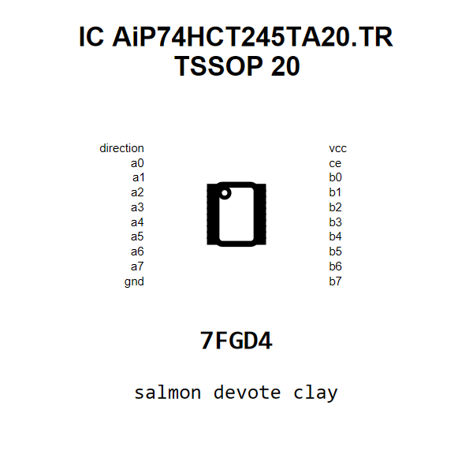

<!-- Generated item page. Full data lives in the source repository. -->
[Catalogue](../../../../../../../README.md) / [Electronic](../../../../../../README.md) / [IC](../../../../../README.md) / [Tssop 20](../../../../README.md) / [Logic](../../../README.md) / [Octal Bus Transceiver](../../README.md) / [Wuxi I Core Elec](../README.md) / Aip74hct245ta20 Tr

# ⚡ IC AiP74HCT245TA20.TR TSSOP 20

> IC AiP74HCT245TA20.TR TSSOP 20 is an OOMP electronic ic definition. It uses the tssop 20 package or form factor. Its nominal drawing size is 6.5 × 4.4 mm. The definition includes 20 documented pins.

[Full details →](https://github.com/oomlout/oomp_electronic_version_5/tree/main/parts/electronic_ic_tssop_20_logic_octal_bus_transceiver_wuxi_i_core_elec_aip74hct245ta20_tr)

## At a glance

| Detail | Value |
| --- | --- |
| Type | Ic |
| Package / style | tssop 20 |
| Nominal size | 6.5 × 4.4 mm |
| Documented pins | 20 |
| OOMP ID | `electronic_ic_tssop_20_logic_octal_bus_transceiver_wuxi_i_core_elec_aip74hct245ta20_tr` |

## Catalogue location

`Electronic › IC › Tssop 20 › Logic › Octal Bus Transceiver › Wuxi I Core Elec › Aip74hct245ta20 Tr`

## About this page

This is the compact catalogue view. A detailed source README is available. Schematics, fabrication data, working metadata, alternate diagrams, availability data, and project analysis stay with the [full original record](https://github.com/oomlout/oomp_electronic_version_5/tree/main/parts/electronic_ic_tssop_20_logic_octal_bus_transceiver_wuxi_i_core_elec_aip74hct245ta20_tr).

---

[↑ Parent category](../README.md) · [Catalogue home](../../../../../../../README.md)
