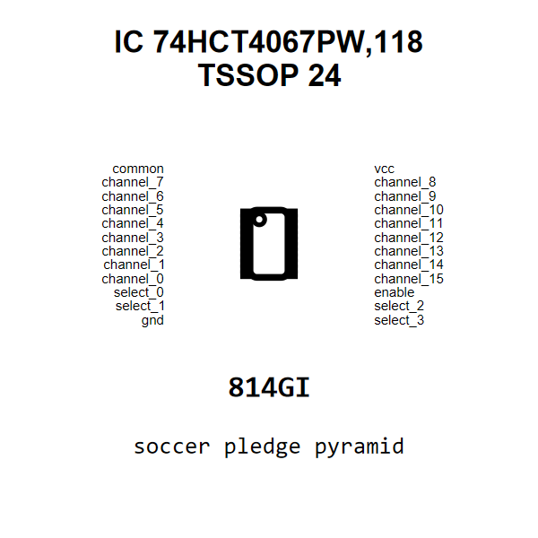

<!-- Generated item page. Full data lives in the source repository. -->
[Catalogue](../../../../../../../README.md) / [Electronic](../../../../../../README.md) / [IC](../../../../../README.md) / [Tssop 24](../../../../README.md) / [Logic](../../../README.md) / [16 Channel Analog Multiplexer](../../README.md) / [Nexperia](../README.md) / 74hct4067pw118

# ⚡ IC 74HCT4067PW,118 TSSOP 24

> IC 74HCT4067PW,118 TSSOP 24 is an OOMP electronic ic definition. It uses the tssop 24 package or form factor. Its nominal drawing size is 7.8 × 4.4 mm. The definition includes 24 documented pins.

[Full details →](https://github.com/oomlout/oomp_electronic_version_5/tree/main/parts/electronic_ic_tssop_24_logic_16_channel_analog_multiplexer_nexperia_74hct4067pw118)

## At a glance

| Detail | Value |
| --- | --- |
| Type | Ic |
| Package / style | tssop 24 |
| Nominal size | 7.8 × 4.4 mm |
| Documented pins | 24 |
| OOMP ID | `electronic_ic_tssop_24_logic_16_channel_analog_multiplexer_nexperia_74hct4067pw118` |

## Catalogue location

`Electronic › IC › Tssop 24 › Logic › 16 Channel Analog Multiplexer › Nexperia › 74hct4067pw118`

## About this page

This is the compact catalogue view. A detailed source README is available. Schematics, fabrication data, working metadata, alternate diagrams, availability data, and project analysis stay with the [full original record](https://github.com/oomlout/oomp_electronic_version_5/tree/main/parts/electronic_ic_tssop_24_logic_16_channel_analog_multiplexer_nexperia_74hct4067pw118).

---

[↑ Parent category](../README.md) · [Catalogue home](../../../../../../../README.md)
