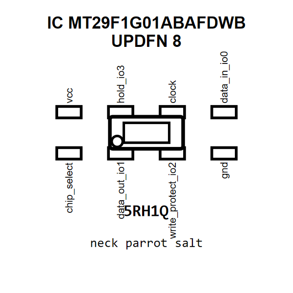

<!-- Generated item page. Full data lives in the source repository. -->
[Catalogue](../../../../../../../README.md) / [Electronic](../../../../../../README.md) / [IC](../../../../../README.md) / [Updfn 8](../../../../README.md) / [Memory](../../../README.md) / [Spi Nand Flash 1 Gbit](../../README.md) / [Micron](../README.md) / Mt29f1g01abafdwb

# ⚡ IC MT29F1G01ABAFDWB UPDFN 8

> IC MT29F1G01ABAFDWB UPDFN 8 is an OOMP electronic ic definition. It uses the updfn 8 package or form factor. Its nominal drawing size is 6.0 × 5.0 mm. The definition includes 8 documented pins.

[Full details →](https://github.com/oomlout/oomp_electronic_version_5/tree/main/parts/electronic_ic_updfn_8_memory_spi_nand_flash_1_gbit_micron_mt29f1g01abafdwb)

## At a glance

| Detail | Value |
| --- | --- |
| Type | Ic |
| Package / style | updfn 8 |
| Nominal size | 6.0 × 5.0 mm |
| Documented pins | 8 |
| OOMP ID | `electronic_ic_updfn_8_memory_spi_nand_flash_1_gbit_micron_mt29f1g01abafdwb` |

## Catalogue location

`Electronic › IC › Updfn 8 › Memory › Spi Nand Flash 1 Gbit › Micron › Mt29f1g01abafdwb`

## About this page

This is the compact catalogue view. A detailed source README is available. Schematics, fabrication data, working metadata, alternate diagrams, availability data, and project analysis stay with the [full original record](https://github.com/oomlout/oomp_electronic_version_5/tree/main/parts/electronic_ic_updfn_8_memory_spi_nand_flash_1_gbit_micron_mt29f1g01abafdwb).

---

[↑ Parent category](../README.md) · [Catalogue home](../../../../../../../README.md)
