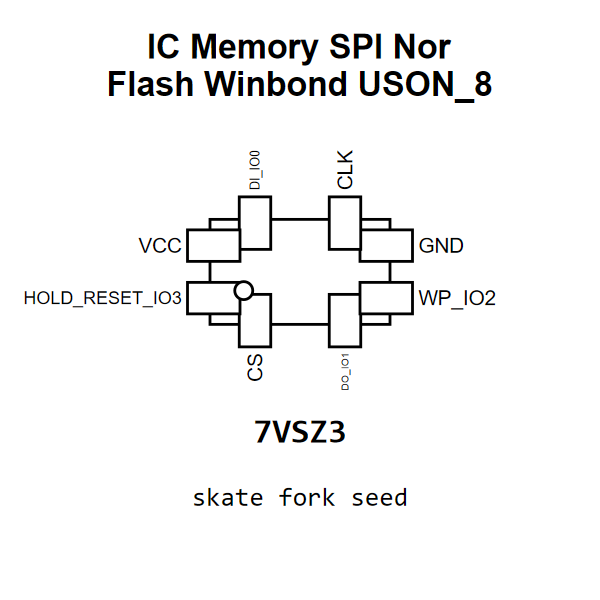

<!-- Generated item page. Full data lives in the source repository. -->
[Catalogue](../../../../../../../README.md) / [Electronic](../../../../../../README.md) / [IC](../../../../../README.md) / [Uson 8](../../../../README.md) / [Memory](../../../README.md) / [Spi Nor Flash](../../README.md) / [Winbond](../README.md) / W25q16jvuxiq

# ⚡ IC Memory SPI Nor Flash Winbond USON_8

> IC Memory SPI Nor Flash Winbond USON_8 is an OOMP electronic ic definition. It uses the uson 8 package or form factor. Its nominal drawing size is 3.0 × 2.0 mm. The definition includes 8 documented pins.

[Full details →](https://github.com/oomlout/oomp_electronic_version_5/tree/main/parts/electronic_ic_uson_8_memory_spi_nor_flash_winbond_w25q16jvuxiq)

## At a glance

| Detail | Value |
| --- | --- |
| Type | Ic |
| Package / style | uson 8 |
| Nominal size | 3.0 × 2.0 mm |
| Documented pins | 8 |
| OOMP ID | `electronic_ic_uson_8_memory_spi_nor_flash_winbond_w25q16jvuxiq` |

## Catalogue location

`Electronic › IC › Uson 8 › Memory › Spi Nor Flash › Winbond › W25q16jvuxiq`

## About this page

This is the compact catalogue view. A detailed source README is available. Schematics, fabrication data, working metadata, alternate diagrams, availability data, and project analysis stay with the [full original record](https://github.com/oomlout/oomp_electronic_version_5/tree/main/parts/electronic_ic_uson_8_memory_spi_nor_flash_winbond_w25q16jvuxiq).

---

[↑ Parent category](../README.md) · [Catalogue home](../../../../../../../README.md)
