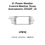

<!-- Generated item page. Full data lives in the source repository. -->
[Catalogue](../../../../../../../README.md) / [Electronic](../../../../../../README.md) / [IC](../../../../../README.md) / [Vssop 10](../../../../README.md) / [Power Monitor](../../../README.md) / [Current Monitor](../../README.md) / [Texas Instruments](../README.md) / Ina228

# ⚡ IC Power Monitor Current Monitor Texas Instruments VSSOP_10

> IC Power Monitor Current Monitor Texas Instruments VSSOP_10 is an OOMP electronic ic definition. It uses the vssop 10 package or form factor. Its nominal drawing size is 4.9 × 3.0 mm. The definition includes 10 documented pins.

**[Full details →](https://github.com/oomlout/oomp_electronic_version_5/tree/main/parts/electronic_ic_vssop_10_power_monitor_current_monitor_texas_instruments_ina228)**

## At a glance

| Detail | Value |
| --- | --- |
| Type | Ic |
| Package / style | vssop 10 |
| Nominal size | 4.9 × 3.0 mm |
| Documented pins | 10 |
| OOMP ID | `electronic_ic_vssop_10_power_monitor_current_monitor_texas_instruments_ina228` |

## Catalogue location

`Electronic › IC › Vssop 10 › Power Monitor › Current Monitor › Texas Instruments › Ina228`

## About this page

This is the compact catalogue view. A detailed source README is available. Schematics, fabrication data, working metadata, alternate diagrams, availability data, and project analysis stay with the [full original record](https://github.com/oomlout/oomp_electronic_version_5/tree/main/parts/electronic_ic_vssop_10_power_monitor_current_monitor_texas_instruments_ina228).

---

[↑ Parent category](../README.md) · [Catalogue home](../../../../../../../README.md)
