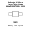

<!-- Generated item page. Full data lives in the source repository. -->
[Catalogue](../../../../../../README.md) / [Electronic](../../../../../README.md) / [Inductor](../../../../README.md) / [0603](../../../README.md) / [10 Micro Henry](../../README.md) / [Taiyo Yuden](../README.md) / Lbmf1608t100k

# ⚡ Inductor 10 Micro Henry Taiyo Yuden LBMF1608T100K 0603

> Inductor 10 Micro Henry Taiyo Yuden LBMF1608T100K 0603 is an OOMP electronic inductor definition. It uses the 0603 package or form factor. Its nominal drawing size is 1.6 × 0.8 mm. The definition includes 2 documented pins.

**[Full details →](https://github.com/oomlout/oomp_electronic_version_5/tree/main/parts/electronic_inductor_0603_10_micro_henry_taiyo_yuden_lbmf1608t100k)**

## At a glance

| Detail | Value |
| --- | --- |
| Type | Inductor |
| Package / style | 0603 |
| Nominal size | 1.6 × 0.8 mm |
| Documented pins | 2 |
| OOMP ID | `electronic_inductor_0603_10_micro_henry_taiyo_yuden_lbmf1608t100k` |

## Catalogue location

`Electronic › Inductor › 0603 › 10 Micro Henry › Taiyo Yuden › Lbmf1608t100k`

## About this page

This is the compact catalogue view. A detailed source README is available. Schematics, fabrication data, working metadata, alternate diagrams, availability data, and project analysis stay with the [full original record](https://github.com/oomlout/oomp_electronic_version_5/tree/main/parts/electronic_inductor_0603_10_micro_henry_taiyo_yuden_lbmf1608t100k).

---

[↑ Parent category](../README.md) · [Catalogue home](../../../../../../README.md)
