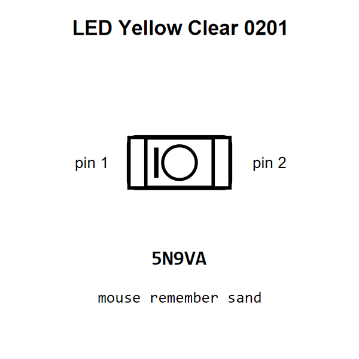

<!-- Generated item page. Full data lives in the source repository. -->
[Catalogue](../../../../../README.md) / [Electronic](../../../../README.md) / [LED](../../../README.md) / [0201](../../README.md) / [Yellow](../README.md) / Clear

# ⚡ LED Yellow Clear 0201

> LED Yellow Clear 0201 is an OOMP electronic led definition. It uses the 0201 package or form factor. Its nominal drawing size is 0.6 × 0.3 mm.

[Full details →](https://github.com/oomlout/oomp_electronic_version_5/tree/main/parts/electronic_led_0201_yellow_clear)

## At a glance

| Detail | Value |
| --- | --- |
| Type | Led |
| Package / style | 0201 |
| Nominal size | 0.6 × 0.3 mm |
| OOMP ID | `electronic_led_0201_yellow_clear` |

## Catalogue location

`Electronic › LED › 0201 › Yellow › Clear`

## About this page

This is the compact catalogue view. A detailed source README is available. Schematics, fabrication data, working metadata, alternate diagrams, availability data, and project analysis stay with the [full original record](https://github.com/oomlout/oomp_electronic_version_5/tree/main/parts/electronic_led_0201_yellow_clear).

---

[↑ Parent category](../README.md) · [Catalogue home](../../../../../README.md)
