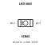

<!-- Generated item page. Full data lives in the source repository. -->
[Catalogue](../../../README.md) / [Electronic](../../README.md) / [LED](../README.md) / 0805

# ⚡ LED  0805

> LED 0805 is an OOMP electronic led definition. It uses the 0805 package or form factor. Its nominal drawing size is 2.0 × 1.25 mm.

**[Full details →](https://github.com/oomlout/oomp_electronic_version_5/tree/main/parts/electronic_led_0805)**

## At a glance

| Detail | Value |
| --- | --- |
| Type | Led |
| Package / style | 0805 |
| Nominal size | 2.0 × 1.25 mm |
| OOMP ID | `electronic_led_0805` |

## Catalogue location

`Electronic › LED › 0805`

## Explore

- **[Blue](blue/README.md)**   3 components
- **[Clear](clear/README.md)**   1 component
- **[Green](green/README.md)**   3 components
- **[Red](red/README.md)**   3 components
- **[Tint](tint/README.md)**   1 component
- **[White](white/README.md)**   3 components
- **[Yellow](yellow/README.md)**   3 components

## About this page

This is the compact catalogue view. A detailed source README is available. Schematics, fabrication data, working metadata, alternate diagrams, availability data, and project analysis stay with the [full original record](https://github.com/oomlout/oomp_electronic_version_5/tree/main/parts/electronic_led_0805).

---

[↑ Parent category](../README.md) · [Catalogue home](../../../README.md)
