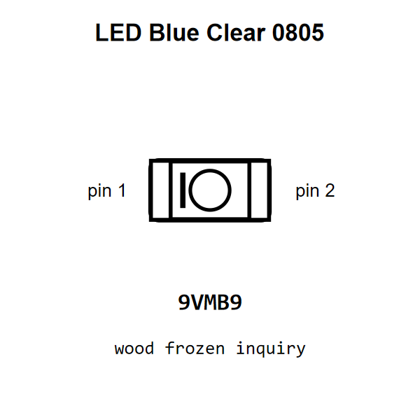

<!-- Generated item page. Full data lives in the source repository. -->
[Catalogue](../../../../../README.md) / [Electronic](../../../../README.md) / [LED](../../../README.md) / [0805](../../README.md) / [Blue](../README.md) / Clear

# ⚡ LED Blue Clear 0805

> LED Blue Clear 0805 is an OOMP electronic led definition. It uses the 0805 package or form factor. Its nominal drawing size is 2.0 × 1.25 mm.

[Full details →](https://github.com/oomlout/oomp_electronic_version_5/tree/main/parts/electronic_led_0805_blue_clear)

## At a glance

| Detail | Value |
| --- | --- |
| Type | Led |
| Package / style | 0805 |
| Nominal size | 2.0 × 1.25 mm |
| OOMP ID | `electronic_led_0805_blue_clear` |

## Catalogue location

`Electronic › LED › 0805 › Blue › Clear`

## About this page

This is the compact catalogue view. A detailed source README is available. Schematics, fabrication data, working metadata, alternate diagrams, availability data, and project analysis stay with the [full original record](https://github.com/oomlout/oomp_electronic_version_5/tree/main/parts/electronic_led_0805_blue_clear).

---

[↑ Parent category](../README.md) · [Catalogue home](../../../../../README.md)
