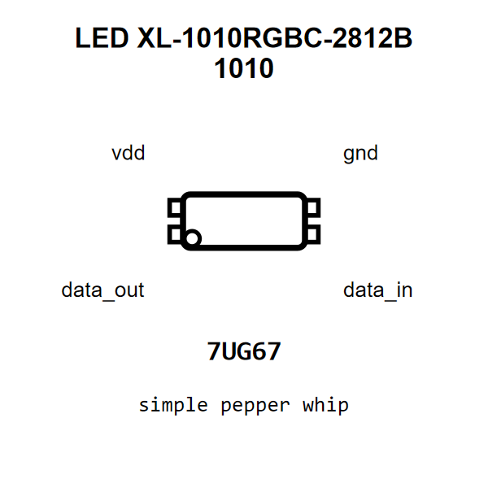

<!-- Generated item page. Full data lives in the source repository. -->
[Catalogue](../../../../../../../README.md) / [Electronic](../../../../../../README.md) / [LED](../../../../../README.md) / [1010](../../../../README.md) / [Rgb](../../../README.md) / [Ws2812b](../../README.md) / [Xinglight](../README.md) / 1010rgbc

# ⚡ LED XL-1010RGBC-2812B 1010

> LED XL-1010RGBC-2812B 1010 is an OOMP electronic led definition. It uses the 1010 package or form factor. Its nominal drawing size is 1.0 × 1.0 mm. The definition includes 4 documented pins.

[Full details →](https://github.com/oomlout/oomp_electronic_version_5/tree/main/parts/electronic_led_1010_rgb_ws2812b_xinglight_1010rgbc)

## At a glance

| Detail | Value |
| --- | --- |
| Type | Led |
| Package / style | 1010 |
| Nominal size | 1.0 × 1.0 mm |
| Documented pins | 4 |
| OOMP ID | `electronic_led_1010_rgb_ws2812b_xinglight_1010rgbc` |

## Catalogue location

`Electronic › LED › 1010 › Rgb › Ws2812b › Xinglight › 1010rgbc`

## About this page

This is the compact catalogue view. A detailed source README is available. Schematics, fabrication data, working metadata, alternate diagrams, availability data, and project analysis stay with the [full original record](https://github.com/oomlout/oomp_electronic_version_5/tree/main/parts/electronic_led_1010_rgb_ws2812b_xinglight_1010rgbc).

---

[↑ Parent category](../README.md) · [Catalogue home](../../../../../../../README.md)
