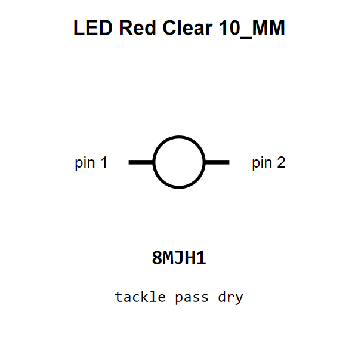

<!-- Generated item page. Full data lives in the source repository. -->
[Catalogue](../../../../../README.md) / [Electronic](../../../../README.md) / [LED](../../../README.md) / [10 Mm](../../README.md) / [Red](../README.md) / Clear

# ⚡ LED Red Clear 10_MM

> LED Red Clear 10_MM is an OOMP electronic led definition. It uses the 10 mm package or form factor. Its nominal drawing size is 10.0 × 10.0 mm.

[Full details →](https://github.com/oomlout/oomp_electronic_version_5/tree/main/parts/electronic_led_10_mm_red_clear)

## At a glance

| Detail | Value |
| --- | --- |
| Type | Led |
| Package / style | 10 mm |
| Nominal size | 10.0 × 10.0 mm |
| OOMP ID | `electronic_led_10_mm_red_clear` |

## Catalogue location

`Electronic › LED › 10 Mm › Red › Clear`

## About this page

This is the compact catalogue view. A detailed source README is available. Schematics, fabrication data, working metadata, alternate diagrams, availability data, and project analysis stay with the [full original record](https://github.com/oomlout/oomp_electronic_version_5/tree/main/parts/electronic_led_10_mm_red_clear).

---

[↑ Parent category](../README.md) · [Catalogue home](../../../../../README.md)
