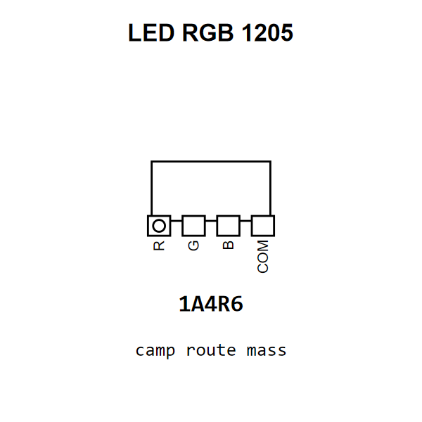

<!-- Generated item page. Full data lives in the source repository. -->
[Catalogue](../../../../README.md) / [Electronic](../../../README.md) / [LED](../../README.md) / [1205](../README.md) / Rgb

# ⚡ LED RGB 1205

> LED RGB 1205 is an OOMP electronic led definition. It uses the 1205 package or form factor. Its nominal drawing size is 3.2 × 1.6 mm. The definition includes 4 documented pins.

[Full details →](https://github.com/oomlout/oomp_electronic_version_5/tree/main/parts/electronic_led_1205_rgb)

## At a glance

| Detail | Value |
| --- | --- |
| Type | Led |
| Package / style | 1205 |
| Nominal size | 3.2 × 1.6 mm |
| Documented pins | 4 |
| OOMP ID | `electronic_led_1205_rgb` |

## Catalogue location

`Electronic › LED › 1205 › Rgb`

## About this page

This is the compact catalogue view. A detailed source README is available. Schematics, fabrication data, working metadata, alternate diagrams, availability data, and project analysis stay with the [full original record](https://github.com/oomlout/oomp_electronic_version_5/tree/main/parts/electronic_led_1205_rgb).

---

[↑ Parent category](../README.md) · [Catalogue home](../../../../README.md)
