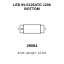

<!-- Generated item page. Full data lives in the source repository. -->
[Catalogue](../../../../README.md) / [Electronic](../../../README.md) / [LED](../../README.md) / [1206 Bottom](../README.md) / Green

# ⚡ LED IN-S126ATG 1206 BOTTOM

> LED IN-S126ATG 1206 BOTTOM is an OOMP electronic led definition. It uses the 1206 bottom package or form factor. Its nominal drawing size is 3.2 × 1.5 mm. The definition includes 2 documented pins.

**[Full details →](https://github.com/oomlout/oomp_electronic_version_5/tree/main/parts/electronic_led_1206_bottom_green)**

## At a glance

| Detail | Value |
| --- | --- |
| Type | Led |
| Package / style | 1206 bottom |
| Nominal size | 3.2 × 1.5 mm |
| Documented pins | 2 |
| OOMP ID | `electronic_led_1206_bottom_green` |

## Catalogue location

`Electronic › LED › 1206 Bottom › Green`

## About this page

This is the compact catalogue view. A detailed source README is available. Schematics, fabrication data, working metadata, alternate diagrams, availability data, and project analysis stay with the [full original record](https://github.com/oomlout/oomp_electronic_version_5/tree/main/parts/electronic_led_1206_bottom_green).

---

[↑ Parent category](../README.md) · [Catalogue home](../../../../README.md)
